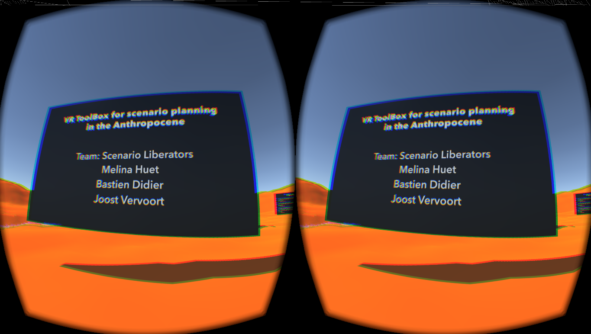
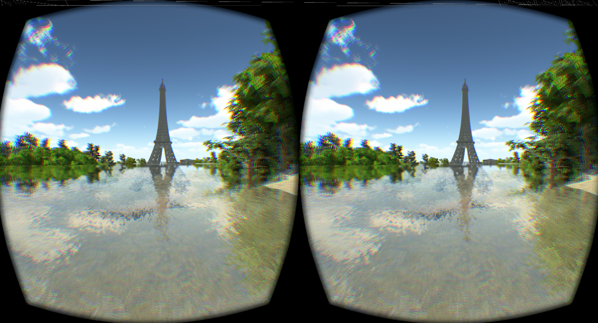
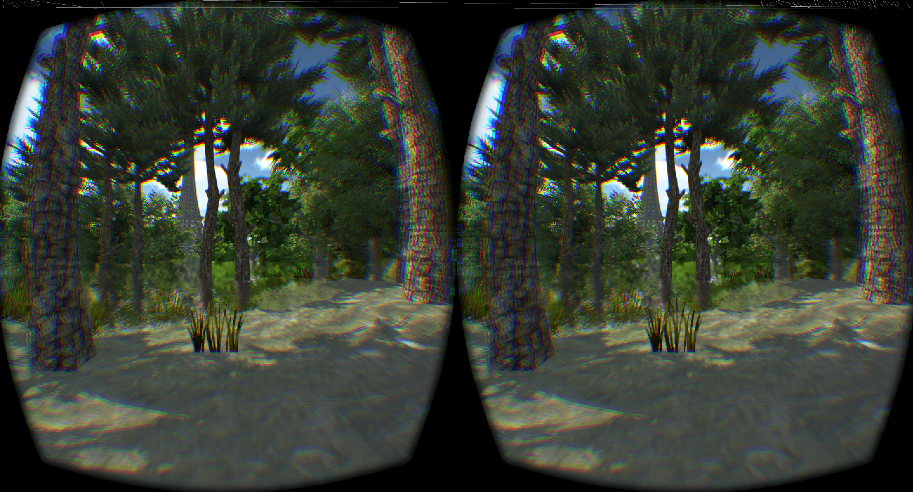

# Anthronaut-Experience
VR toolbox for scenario planning in the Anthropocene

Create a toolbox to make it very simple for stakeholders, with rather quick and easy technical mediation (one person, 1 day, Unity), to have their own scenarios of the future represented in VR.

Demo

Melina Huet, Bastien Didier, Joost Vervoort